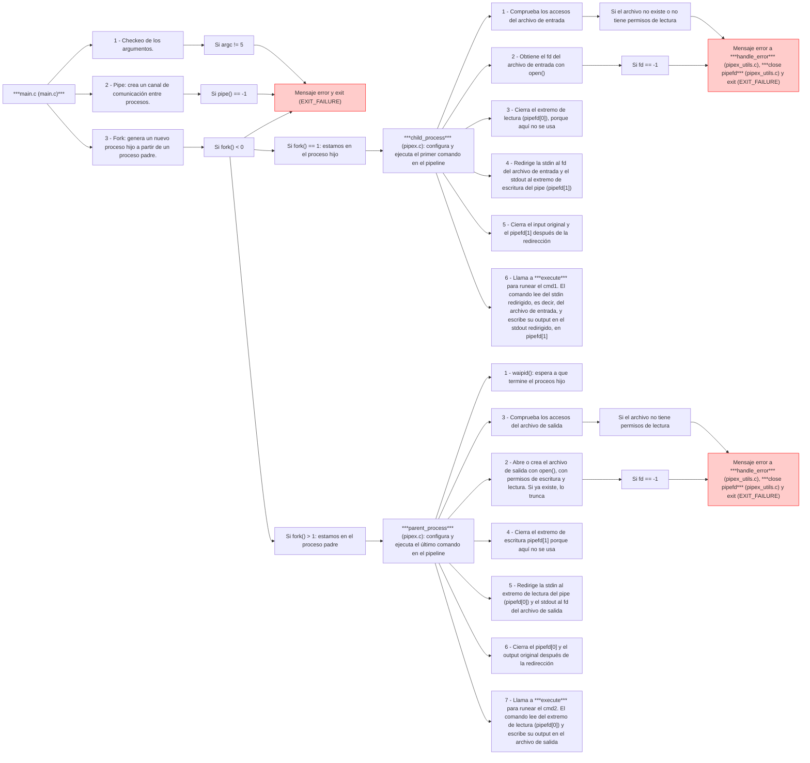
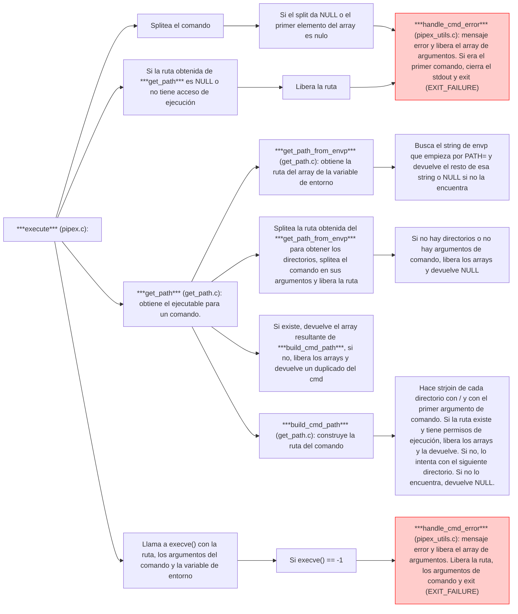
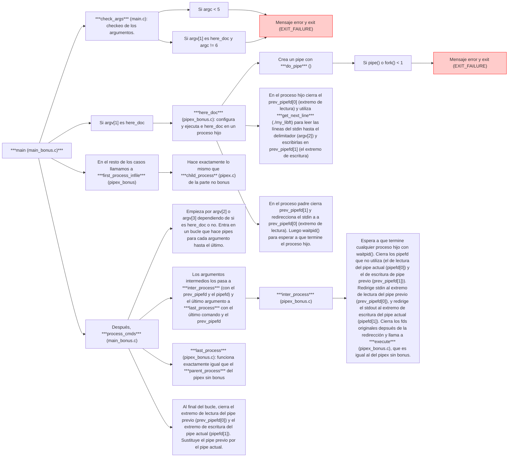

# MI-MINISHELL

Proyecto Minishell de 42. 

### Introducción

blblabla

Cosas que tiene que hacer el shell:

- Mostrar una entrada mientras espera un comando nuevo (readline con prompt??)
- Tener un historial funcional (add_history()??)

- Buscar y ejecutar el ejecutable correcto (basado en la variable PATH ✅ o mediante el uso de rutas relativas o absolutas ❌) --> con PATH lo tenemos, lo otro hay que mirar

- Evitar usar más de una variable global para indicar la recepción de una señal (para lo de la recepción de señales)

PARSEO / GESTON INPUT

- No interpretar comillas sin cerrar o caracteres especiales no especificados en el enunciado como \ o ;
- Gestionar que la ' evite que el shell interprete los metacaracteres en la secuencia entrecomillada
- Gestionar que la " evite que el shell interprete los metacaracteres en la secuencia entrecomillada exceptuando el $.

----------------------------------
_LO QUE TENEMOS POR AHORA DE GESITÓN DE INPUT (process_input() en prueba_process_input.c)_

- Recibimos la línea del input con readline() en el main.
- split_commands() -> separa la línea del input en comandos con el pipe ('|') como separador. Cada uno de estos comandos tendrá un comando propiamente dicho, y puede tener un infile y un outfile. Si no los tiene, significa que funciona con el STDIN o el STDOUT o las redirecciones que le toque con el pipe.
- itera a través de estos comandos con process_commands()
- cada comando es procesado en process_single_command()
- process_single_comand() ->
  1. splitea el comando (compuesto por comando propiamente dicho, sus argumentos y, si hay, infile y/o outfile) en tokens con split_tokens() con espacio (' ') como separador.
  2. Da memoria y guarda los argumentos con allocate_args() (!! -> aquí habrá que liberar o realocar memoria, porque da memoria tanto a comandos propiamente dichos como a infiles y outfiles, y posteriormente los files los vamos a guardar en otro sitio, así que nos va a sobrar memoria en args).
  3. Cuenta la cantidad de redirecciones de output con count_outfile_redirections() (porque podemos tener varias y eso significa que hay que crear todos los archivos aunque al final solo utilicemos el último). count_outfile_redirections() guarda los nombres de outfile en el array de char node->outfile_name y los tipos de redirecciones (si son APPEND o TRUNC) en el array de ints node->outfile_type.
  4. Procesamiento de tokens con process_tokens(), que identifica si el token es una redireccion u otra cosa -> si es una redirección, lo gestiona con handel_redirection(), que identifica el tipo de redirección y guarda el file asociado donde le toca (si es infile u outfile y de qué tipo) (!! esto no se repite con lo de contar el número de otufiles???); si no es una redirección, guarda los argumentos (comandos propiamente dichos) en node->full_cmd (!! aquí es donde nos sobra memoria (??) basta con un free(args) para solucionarlo?).
  
_LO QUE FALTA DE GESITÓN DE INPUT_

Interpretación de comillas:

- '
- "
- caracteres especiales
- comillas sin cerrar
- lo de $

----------------------------------------

REDIRECCIONES Y EJECUCION

- Implementar redirecciones: 
  - "<" redirige el input ✅
  - ">" redirige el output ✅ 
   
     - Si haces cat infile.txt > outfile1.txt > outfile2.txt > outfile3.txt > outfile4.txt lo que hace bash es generar todos estos outfiles pero no guardar el resultado en ellos, solo lo guarda en el último generado. ~~Nuestra minishell solo crea el último Y DEBERÍA CREAR TODOS! --> POSIBLE SOLUCIÓN: ALTERAR LA ESTRUCTURA DE NODO Y PONER CHAR *OUTFILE_NAMES PARA QUE SEA UN ARRAY DE OUTFILE_NAMES; tb hacer int *outfile_type, necesitamos saber si cada uno de estos outfiles tiene que ser abierto con > o con >> (esto es necesario porque si tenemos una redirección tipo APPEND en el outfile intermedio, no borrará lo que hay en este outfile; si es tipo TRUNC, sí lo hará). EN SET_OUT_FD ITERAR A TRAVÉS DE TODOS ESOS NOMBRES, ABRIRLOS Y CREARLOS COMO TOCA Y EN LOS PROCESOS REDIRIGIR SOLO EL ÚLTIMO OUTFILE_NAME (ITERANDO SOBRE ELLOS?).~~ Ya funciona.
       
  - "<<" recibe un delimitador. Lee del input de la fuente actual hasta que aparezca una línea que contenga solo el delimitador. No necesita utilizar el historial. (ESTO SERÁ SUSTITUIR EL READLINE POR UN GET_NEXT_LINE CON X CARACTER/DELIMITADOR EN VEZ DE CON \N?? --> MIRAR SI OTROS MINISHELLS GUARDAN EL DELIMITADOR EN LA ESTRUCTURA DEL NODO) ❌
  - ">>" redirige el output en modo append ✅
- Implementar pipes (|). El output de cada comando en la pipeline se conecta a través de un pipe al input del siguiente comando ✅
- Gestionar $?: debe expandirse al estado de salida del comando más reciente ejecutado en la pipeline --> RELACIONADO CON VARIABLE GLOBAL (?) -> extern int	g_status --> relacionado con errno y etc, codigos de error!!!

  SIGNAL... (?)
- Gestionar ctr-C, ctrl-D y ctrl-\, que deben funcionar como en bash
- Cuando sea interactivo: (--> esto va con las señales, EFRAIN - .20), funcion signal())
   - ctrl-C: imprime una nueva entrada en una línea nueva
   - ctrl-D: termina el shell
   - ctrl-\: no hace nada
  
BUILINTS
- Implementar los built-ins (esto son funciones aparte que hay que diseñar, supongo que tendrán que guardarse en la estructura de nodo en la parte de full_cmd, pero al ejecutar (execute()) no hay que buscar su PATH, si no que habrá que ejecutar la función (?)).
   - echo con la opción -n
   - cd solo con una ruta relativa o absoluta
   - pwd sin opciones
   - export sin opciones
   - unset sin opciones
   - env sin opciones (hay que guardar nuestra propia env para poder modificarla...)
   - exit sin opciones

 ### Funciones autorizadas

| ***readline()***   |          |
|------------------|-----------------|
| Librería| readline/readline.h |
| ¿Qué hace?| Lee una línea de la terminal y la devuelve. |
| Prototipo| char *readline(const char *prompt) |
| Argumentos|prompt: mensaje que se pone delante de la línea leída que devuelve. |
| Return   |  |

| ***rl_clear_history()***   |          |
|------------------|-----------------|
| Librería| #include <readline/readline.h> |
| ¿Qué hace?| Limpiar el historial de líneas escritas en el terminal// Preparar el espacio para escribir nuevas líneas sin que aparezcan las antiguas |
| Prototipo| void rl_clear_history(void) |
| Argumentos| |
| Return   | |

| ***rl_on_new_line()***   |          |
|------------------|-----------------|
| Librería| #include <readline/readline.h> |
| ¿Qué hace?| Se utiliza para configurar el comportamiento del terminal cuando una nueva línea se inserta. En particular, esta función permite especificar qué acción debe tomar el terminal cuando se presiona la tecla de retorno en un campo de texto |
| Prototipo| void rl_on_new_line(int new_line) |
| Argumentos|???|
| Return   | |

| ***rl_replace_line()***   |          |
|------------------|-----------------|
| Librería| #include <readline/readline.h> |
| ¿Qué hace?| se utiliza para reemplazar una parte del texto de una línea con un nuevo texto. Esta función es útil cuando se quiere personalizar el comportamiento del terminal en relación con las líneas.|
| Prototipo| int rl_replace_line(const char *buf, const char *, const char *)|
| Argumentos|`const char *buf`: Una puntero a un carácter (`char`) que contiene el texto que se va a reemplazar en la línea actual.`const char *`: Un puntero a un carácter (`char`) que indica el carácter de finalización de la línea. En este caso, no está claro qué valor exacto se espera aquí, pero es común utilizar `\n` para indicar el final de una línea.`const char *`: Un puntero a un carácter (`char`) que contiene el texto que se va a reemplazar en la línea actual.
| Return   | 0, cuando hay una línea en el buffer y se reemplaza todo el contenido, -1, si  no hay una línea en el buffer o cuando la línea es vacía y se intenta reemplazarla con un carácter de finalización|

| ***rl_redisplay()***   |          |
|------------------|-----------------|
| Librería| #include <readline/readline.h> |
| ¿Qué hace?| Se utiliza para actualizar y mostrar el contenido del buffer de la terminal. Esto significa que se actualizan los caracteres en el buffer que han cambiado desde la última vez que se mostró el buffer|
| Prototipo| void rl_redisplay(void) |
| Argumentos| |
| Return   | |

| ***add_history()***   |          |
|------------------|-----------------|
| Librería| #include <readline/readline.h> |
| ¿Qué hace?| 1.  Verifica si ya se ha llamado a esta función para agregar contenido   al historial de líneas.   2.  Si no es así, agrega el contenido del buffer de texto al historial   de líneas.   3.  Actualiza la posición del cursor en la terminal.|
| Prototipo| char *add_history(const char *const _buf)|
| Argumentos|_buf`: Es un constante pointer a una cadena de caracteres (`const char *const`).|
| Return   | puntero a una cadena de caracteres (`char *`) que apunta al contenido agregado al historial de líneas.|

| ***access()***   |          |
|------------------|-----------------|
| Librería| unistd.h |
| ¿Qué hace?     |Comprueba la accesibilidad de un archivo o directorio. |
| Prototipo      |int access(const char *pathname, int mode)|
| Argumentos     |pahtname: cadena que representa la ruta.   mode: entero que especifica el tipo de acceso que queremos verificar.   - F_OK: verifica la existencia del archivo.   - F_OK: verifica la existencia del archivo.   - R_OK: accesible para lectura.   - W_OK: accesible para escritura.    - X_OK: accesible para ejecución.|
| Return   | Devuelve 0 si el acceso especificado está permitido,  en caso contrario devuelve -1 y esatblece errno.|

| ***open()***   |          |
|------------------|-----------------|
| Librería| unistd.h  |
| ¿Qué hace?      | Abre un archivo y obtiene su file descriptor (fd)|
| Prototipo         | int open(const char *pathname, int flags, mode_t mode) |
| Argumentos       |   pahtname: ruta del archivo.   flags: entero que especifica el modo en el que se abre el archivo.   Algunos modos comunes:     - O_RDONLY: solo lectura.   - O_WRONLY: solo escritura.   - O_RDWR: lectura y escritura.   - O_CREAT: crea el archivo si no existe.   - O_TRUNC: si el archivo existe,  elimina su contenido.   - O_APPEND: escribe al final del archivo sin truncarlo.   mode: solo se utiliza con O_CREAT,   establece los permisos del archivo, expresados en octal.|
| Return   | Devuelve un fd en caso de éxito y -1 en caso de error.|

| ***close()***   |                 |
|------------------|-----------------|
| Librería| unistd.h  |
| ¿Qué hace?      | Cierra un archivo que ha sido abierto mediante open().   Al cerrarlo, el sistema libera el fd y cualquier recurso asociado,   permitiendo que el SO reutilice el descriptor para otras operaciones.|
| Prototipo         | Prototipo: int close(int fd)|
| Return   | Devuelve 0 en caso de éxito y en caso de error, -1 y establece errno .|

| ***read()***   |          |
|------------------|-----------------|
| Librería| unistd.h |
| ¿Qué hace?      | Lee datos desde un archivo (a partir de su fd) o entrada (como stdin).|
| Prototipo       |ssize_t read (int fd, void *buffer, size_t count) |
| Argumentos       |fd: file descriptor desde el que se quiere leer.   Se obtiene mediante open() o dup() o un descritor estándar como 0 (stdin).  buffer: puntero a un espacio de memoria donde se almacenarán los datos leídos.   count: número máximo de bytes que se intentarán leer.|
| Return   | Devuelve el número de bytes leídos. Si se alcanza el final del archivo (EOF),   devuelve 0. Devuelve -1 y establece errno en caso de error.|

También hemos visto fork8), wait(), waitpid()... Pero y wait3, wait4??

| ***dup()***   |          |
|------------------|-----------------|
| Librería| unistd.h |
| ¿Qué hace?      |Duplica fds. Útil para redirigir entradas y salidas, especialmente en procesos   que necesitan manipular la stdin, la stdout o la stderr.|
| Prototipo         |int dup(int oldfd)|
| Argumentos       |oldfd: file descriptor que se desea duplicar.|
| Return   | Devuelve el nuevo fd duplicado o 1 en caso de error, estableciendo errno.   El nuevo fd apunta al mismo archivo que oldfd, comparten el mismo puntero   de archivo y hereda los mismos permisos de acceso.|

| ***dup2()***   |          |
|------------------|-----------------|
| Librería| unistd.h |
| ¿Qué hace?      |Duplica un fd en un nuevo fd.|
| Prototipo         |int dup(int oldfd, int newfd)|
| Argumentos       |oldfd: fd que se desea duplicar.   newfd: nuevo fd.   Si newfd está en uso, dup2 lo cierra antes de duplicar oldfd en él.|
| Return   | Devuelve newfd o -1 en caso de error.|

| ***execve()***   |          |
|------------------|-----------------|
| Librería| unistd.h |
| ¿Qué hace?      |Reemplaza el proceso actual con un nuevo programa.   Se utiliza para ejecutar un programa especificado en un archivo ejecutable,   con el entorno y los argumentos que se le proporcionan.  |
| Prototipo         |int execve(const char *filename, char *const argv[], char *const envp[])|
| Argumentos       |filename: ruta del archivo ejecutable.   argv: array de cadenas que representan los argumentos del programa.    envp: array de cadenas que contiene las variables de entorno.|
| Return   | En caso de éxito, no devuelve nada; el proceso actual se reemplaza   por el nuevo programa y la ejecución continúa desde el punto de entrada   del nuevo programa. En caso de error devuelve -1 y establece errno.|

| ***exit()***   |          |
|------------------|-----------------|
| ¿Qué hace?      |Termina un programa de manera controlada. Permite salir de un programa   con un código de estado que indica si la salida fue exitosa o si ocurrió un error.|
| Prototipo         | void exit(int status) |
| Argumentos       |status: entero que se devuelve al SO cuando el programa termina.   Este valor puede indicar éxito (0) o error (valor distinto de 0).|

| ***fork()***   |          |
|------------------|-----------------|
| Librería| unistd.h |
| ¿Qué hace?      |Genera un nuevo proceso hijo a partir de un proceso padre.   El proceso hijo es una copia del proceso padre, pero tiene su propio PID   (indentificador de proceso). El proceso padre y el proceso hijo   se ejecutan simultáneamente,  aunque pueden comportarse de manera diferente.|
| Prototipo         | fd_t fork(void) |
| Return   | En el proceso padre, fork() devuelve el PID del proceso hijo.   El el proceso hijo, fork() devuelve 0.   Si fork() falla, devuelve -1 en el proceso padre y no crea ningún proceso hijo.|

| ***pipe()***   |          |
|------------------|-----------------|
| Librería| unistd.h |
| ¿Qué hace?      |Crea un canal de comunicación unidireccional entre procesos.   Permite que un proceso (el escritor) envíe datos a otro proceso (el lector)   a través de un buffer de memoria.   pipe() crea un array de dos fds que representan los extremos del pipe.   - pipefd[0]: extremo de lectura.   - pipefd[1]: extremo de escritura.   pipefd[1] escribirá en su fd y pipefd[0] leerá el pipefd[1] y escribirá en su propio fd. |
| Prototipo         |int pipe(int pipefd[2])|
| Return   | Devuelve 0 en caso de éxito y en caso de error devuelve -1 y establece errno.|

    //Ejemplo: fork() y pipe()

    pid_t    do_pipe(int pipefd[2])
    {
        pid_t    pid;

        if (pipe(pipefd) == -1)
        {
            perror("Pipe");
            exit(EXIT_FAILURE);
        }
        pid = fork();
        if (pid < 0)
        {
            perror("Fork");
            exit(EXIT_FAILURE);
        }
        return (pid);
    }

    int    main(void)
    {
        pid_t    pid;
        int      pipefd[2];

        pid = do_pipe(pipefd);
        if (pid == 0)
            printf("Estamos en el proceso hijo.\n");
        else
            printf("Estamos en el proceso padre.\n");
        return (0);
    }

    | ***wait()***   |          |
|------------------|-----------------|
| Librería|  |
| ¿Qué hace?      |Permite que un proceso padre suspenda su ejecución hasta que   uno de sus procesos hijo termine. Cuando un proceso hijo finaliza,   wait() recupera su estado de salida, lo que permite al proceso padre   realizar tareas específicas dependiendo del resultado de la ejecución del hijo. |
| Prototipo         |pid_t wait(int *status)|
| Argumentos       |status: puntero a un entero donde wait() almacena el estado de salida del hijo.   Este valor sirve para obtener información sobre cómo terminó el proceso hijo,  normalmente mediante macros como WIFEXITED o WEXITSTATUS...|
| Return   | Devuelve el PID del hijo que terminó en caso de éxito.   Si no hay hijos a los que esperar, devuelve -1 y establece errno.|

**ERRNO
->ECHILD: Indica que no hay procesos hijos. Esto puede ocurrir si todos los procesos hijos ya han terminado y sus estados ya han sido recogidos.
->EINTR: La llamada a wait() fue interrumpida por una señal antes de que cualquier proceso hijo terminara.
->EINVAL: Se pasó un argumento inválido a la llamada de sistema. Aunque esto es menos común con wait(), puede ocurrir con funciones relacionadas como waitpid().

| ***waitpid()***   |          |
|------------------|-----------------|
| ¿Qué hace?      |Permite que un proceso padre espere a que un proceso hijo termine su ejecución.   Es más flexible que wait porque permite especificar a qué proceso hijo se debe esperar.   Útil cuando hay múltiples procesos hijo. |
| Prototipo         |pid_t waitpid(pid_t pid, int *status, int options)|
| Argumentos       |pid: puede ser el PID del proceso hijo al que se quiere esperar.   Si es -1 indica que se espera a cualquier proceso hijo (comportamiento similar a wait()).   Si es 0 espera a cualquier proceso hijo del mismo grupo de procesos.   Si es otro valor negativo, espera a cualquier hijo cuyo grupo de procesos sea el mismo   que el del proceso padre.   status: puntero a un entero donde wait() almacena el estado de salida del hijo.   Este valor sirve para obtener información sobre cómo terminó el proceso hijo,   normalmente mediante macros como WIFEXITED o WEXITSTATUS...   options: 0 indica el comportamiento estándar, espera a que el hijo termine.   WNOHANG no bloquea, si no hay hijos que no hayan terminado, retorna inmediatamente.   WUNTRACED también retorna si un hijo está detenido. |
| Return   | Devuelve el PID del hijo que terminó en caso de éxito. En caso de error, devuelve -1 y establece errno.|

| ***perror()***   |          |
|------------------|-----------------|
| ¿Qué hace?      | Imprime un mensaje de error en stderr.   Muestra un mensaje personalizado junto con la descripción del error   correspondiente a errno.|
| Prototipo         | void perror(const char *s)|
| Argumentos       |s: Mensaje personalizado a imprimir antes de la descripción del error.|

| ***strerror()***   |          |
|------------------|-----------------|
| ¿Qué hace?      | Convierte el valor de errno en un mensaje de error. |
| Prototipo         | char *strerror(int errnum) |
| Argumentos       |errnum: código de error a convertir en un mensaje de error.   Típicamente es el valor de errno después de una operación fallida.|
| Return   | Devuelve un puntero a una cadena con el mensaje de error   correspondiente al valor de errnum.|

| ***signal()***   |          |
|------------------|-----------------|
| Librería| #include <signal.h> |
| ¿Qué hace?| permite manejar señales en un programa. Una señal es una interruptión no esperada por el sistema operativo que causa un programa a cambiar su comportamiento o a terminar |
| Prototipo| int signal(int sig, void (*func)(int)) |
| Argumentos| **`sig`**: Es el número de señal. Puedes encontrar este valor en una tabla de señales (señales numéricas) o mediante funciones como `sigaction()`, `kill()` y `SIGALRM`|
| Return   | ????|

SIGINT -> Ctrl + C -> interrupción del usuario
SIGQUIT -> termina el programa inmediatamente -> Ctrl + \  --> EN LA HOJA DE PROYECTO PONE QUE ESTO NO TIENE QUE HACER NADA
SIGPIPE -> Ctrl + D -> tiene que terminar el shell

| ***signaction()***   |          |
|------------------|-----------------|
| Librería| <signal.h> |
| ¿Qué hace?| Se utiliza para cambiar la acción que el proceso debe realizar al recibir una señal específica. Es una alternativa más flexible y potente a la función signal()|
| Prototipo| int sigaction(int signum, const struct sigaction *act, struct sigaction *oldact) |
| Argumentos| signum: El número de la señal que se desea manejar (por ejemplo, SIGINT para una interrupción del teclado). act: Un puntero a una estructura struct sigaction que especifica la nueva acción para la señal. oldact: Un puntero a una estructura struct sigaction donde se almacenará la acción anterior para la señal. Este parámetro puede ser NULL si no se desea recuperar la acción anterior|
| Return   | Si sigaction() retorna 0, sabes que la operación fue exitosa. Si retorna -1, puedes mirar el valor de errno para averiguar qué salió mal. "Errno" es una variable global que indica el error específico|

| ***kill()***   |          |
|------------------|-----------------|
| Librería| <signal.h> |
| ¿Qué hace?| Se utiliza para enviar señales a procesos. A pesar de su nombre, no necesariamente se utiliza para "matar" un proceso; puede enviar cualquier señal especificada al proceso indicado. |
| Prototipo| int kill(pid_t pid, int sig) |
| Argumentos| pid: El identificador del proceso al que se desea enviar la señal.   pid > 0: Envía la señal al proceso cuyo ID es pid.   pid == 0: Envía la señal a todos los procesos en el mismo grupo de procesos que el proceso que llama.   pid == -1: Envía la señal a todos los procesos para los cuales el proceso que llama tenga permisos para enviar señales, excepto al proceso 1 (init).   pid < -1: Envía la señal a todos los procesos en el grupo de procesos cuyo ID es -pid.   sig: El número de la señal que se desea enviar. Algunas señales comunes incluyen:   SIGTERM: Solicita la terminación del proceso.  SIGKILL: Fuerza la terminación del proceso.   SIGINT: Interrumpe el proceso (equivalente a Ctrl+C en la terminal).   SIGHUP: Señal de desconexión. |
| Return   | "0" si la señal se ha enviado con éxito, "-1" si se ha producido un error. En este caso, la variable global errno se establece para proporcionar información adicional sobre el tipo de error|

exit()???

| ***getcwd()***   |          |
|------------------|-----------------|
| Librería| <unistd.h> |
| ¿Qué hace?| Llena la matriz de caracteres apuntada por buf con la ruta del directorio de trabajo actual. La ruta se almacena como una cadena de caracteres terminada en nulo (\0). Si buf es NULL, getcwd() asigna una matriz de tamaño size usando malloc() y devuelve un puntero a esta matriz; el llamador es responsable de liberar esta memoria.|
| Prototipo| char *getcwd(char *buf, size_t size) |
| Argumentos| buf: Un puntero a una matriz de caracteres donde se almacenará el directorio de trabajo actual. size: El tamaño de la matriz buf. Debe ser lo suficientemente grande como para contener la ruta completa del directorio de trabajo actual, incluyendo el terminador nulo. |
| Return   | Puntero a la matriz de caracteres buf que contiene la ruta del directorio de trabajo actual. Retorna NULL y establece la variable global errno para indicar el error específico |

*ERRNO
-> ERANGE: El tamaño del buffer size es insuficiente.
-> EINVAL: size es 0 o negativo.
-> ENOMEM: No hay suficiente memoria disponible para asignar el buffer.

| ***chdir()***   |          |
|------------------|-----------------|
| Librería| <unistd.h> |
| ¿Qué hace?| Cambia el directorio de trabajo actual del proceso al directorio especificado por path. Este cambio afecta a todas las operaciones que se realicen después de la llamada a chdir() y que dependan del directorio de trabajo actual |
| Prototipo| int chdir(const char *path) |
| Argumentos| path: Un puntero a una cadena de caracteres que especifica la ruta del nuevo directorio de trabajo. Puede ser una ruta absoluta o relativa. |
| Return   | En caso de éxito: Retorna 0.  En caso de error: Retorna -1 y establece la variable global errno para indicar el error específico. |

*ERRNO
->EACCES: Permiso denegado para el directorio especificado.
->EFAULT: path apunta fuera del espacio de direcciones accesible.
->EINVAL: path no es válido.
->ENOENT: El directorio especificado no existe.
->ENOTDIR: Una parte de path no es un directorio.

### Parsing

### Ejecución/pipex

COSAS QUE SE TIENEN QUE HACER:

- Buscar y ejecutar el ejecutable correcto (basado en PATH o mediante el uso de rutas relativas o absolutas)
- Implementar redirecciones
- Implementar pipes

- 

Cómo va la cosa (20.12.24):

COSAS QUE FUNCIONAN:
- Si se ejecuta ./minishell empieza el loop con "minishell: "
- Si los comandos que se le pasan funcionan, vuelve a mostrar "minishell: "
- Nodos: guarda el nombre en formato char* del infile y el outfile, el tipo de outfile (si > es tipo APPEND y si >> es tipo TRUNC; se hace open() con diferentes parámetros), guarda el comando y sus argumentos en un char**, guarda el puntero al nodo previo y al next
- Sin pipes: se genera un solo nodo y acepta bien las redirecciones < , > y >>
  
      Ejemplo: < infile.txt cat > outfile.txt
              - Sin infile: lee del stdin hasta que se presiona Ctrl-D -> pero creo que Ctrl-D debe terminar el shell. Si eso es así, no se hasta cuándo debería leer del stdin (!!!)
              - Sin outfile: escribe en el stdout: esto funciona bien
- Con pipes: crea el número de nodos correcto

COSAS QUE NO FUNCIONAN:
- Si se introduce un comando inválido, el programa no termina pero no vuelve a mostrar la salida "minishell: "

### Estado comando previo ... $?

***Códigos de error***

 

***Ejemplo de códigos error***

 

***getenv()***

 

### Builints ??

### Recursos
https://www.youtube.com/watch?v=yTR00r8vBH8 (video de Oceano, guia simplificada)
#### Resumen video
1) 
Crea main.c y una funcion de get_line, basicamente, para sacar cosas por pantalla.
Hace referencia a REPL; ReadEvaluatePrintLoop, protocolo de bash.
---Stands for Read-Eval-Print Loop. It's an interactive programming environment commonly used in scripting languages like Python, Ruby, and JavaScript. Here's a quick breakdown of how it works:
A)Read: The REPL reads the user's input or command.
B)Eval: It evaluates (executes) the command or code entered.
C)Print: It prints out the result of the evaluation.
D)Loop: It loops back to allow the user to input another command.

3)
Crea utils.c y una funcion que es getcwd, Se usa para que cuando nos movamos por la terminal aparezca la ruta del archivo en que estemos.
Ademas de esto tambien a que aparezca un logo al iniciar la minihell.
4)
Digamos que la segunada parte, usa funcion gettokens.

La función `strtok()` tiene los siguientes pasos:

1.  **Obtención de la cadena de texto**: Recibe una cadena de texto como 
entrada y devuelve una cadena de texto actualizada que contiene el token 
más reciente encontrado.
2.  **Delimitador**: La función utiliza un carácter de delimitador (por 
ejemplo, espacio en blanco, tabulador, coma, etc.) para dividir la cadena 
de texto en tokens individuales.
3.  **Tokenización**: Comienza a leer la cadena de texto y busca el primer 
delimitador que encuentre. Al encontrarlo, devuelve la palabra 
correspondiente al token más reciente encontrado hasta ahora.
4.  **Nueva posición**: En cada llamada a la función, se mantiene la 
posición actual en la cadena de texto. Esto significa que si se llama a 
`strtok()` varias veces, siempre se devolverá el siguiente token 
encontrado.
 
Funciones usadas:
*get_line
*read_line
*getwdc
*gettoken -> https://craftinginterpreters.com/scanning.html (** La guia es de Java, pero se puede entender lo que son los tokens**)

https://github.com/EfrainVisconti/Minishell/tree/main/src

https://github.com/madebypixel02/minishell?tab=readme-ov-file

https://github.com/cclaude42/minishell

### Flujo de pipex

Apuntes varios:
- pipe() -> crea un canal de comunicación entre procesos.
- fork() -> genera un nuevo proceso hijo a partir de un proceso padre

### Flujo de bonus

EL BONUS NO LO TUVE 100% BIEN!! ME FALLA EL HERE_DOC

